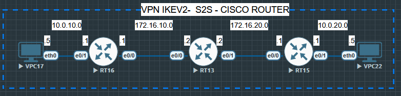

## Info

A interface virtual será endereçada na rede `10.0.30.0/255`. Não há a necessidade de pré-definir as rotas para as redes internas, pois elas serão definidas a partir do túnel.
***
## SITE_A
#### Configuração ``IKEv2`` (**Phase 1**)

Primeiro criamos a proposta de criptografia.
```
crypto ikev2 proposal IKEv2-PROPOSAL
	encryption aes-cbc-256
	integrity sha512
	group 19
	exit
```

Agora criamos a política IKv2.
```
crypto ikev2 policy IKEv2-POLICY
	proposal IKEv2-PROPOSAL
	exit
```

Agora criamos a chave pré-compartilhada (`keyring`).
```
crypto ikev2 keyring VPN-KEYRING
	peer SITE-B
		address 172.16.20.1
		pre-shared-key cisco12345
		exit
	exit
```

Agora criamos o perfil IKEv2
```
crypto ikev2 profile IKEv2-PROFILE
	match identity remote address 172.16.20.1 255.255.255.255
	authentication remote pre-share
	authentication local pre-share
	keyring local VPN-KEYRING
	exit
```

#### Configuração ``IPSec`` (**Phase 2**)
Transform set para `ESP` 
```
crypto ipsec transform-set ESP-TRANSFORM esp-aes 256 esp-sha512-hmac
	mode tunnel
	exit
```

Criar um profile `IPSec`
```
crypto ipsec profile IPSEC-PROFILE
	set transform-set ESP-TRANSFORM
	set ikev2-profile IKEv2-PROFILE
```

Agora configuramos o túnel virtual
```
interface Tunnel 10
	ip address 10.0.30.1 255.255.255.252
	tunnel source ethernet 0/0
	tunnel destination 172.16.20.1
	tunnel mode ipsec ipv4
	tunnel protection ipsec profile IPSEC-PROFILE
	exit
```

Rota para a rede remota interna.
```
ip route 10.0.20.0 255.255.255.0 Tunnel 10
```
***
## SITE_B
#### Configuração ``IKEv2`` (**Phase 1**)
```
crypto ikev2 proposal IKEv2-PROPOSAL
	encryption aes-cbc-256
	integrity sha512
	group 19
	exit

crypto ikev2 policy IKEv2-POLICY
	proposal IKEv2-PROPOSAL
	exit

crypto ikev2 keyring VPN-KEYRING
	peer SITE-A
		address 172.16.10.1
		pre-shared-key cisco12345
		exit
	exit

crypto ikev2 profile IKEv2-PROFILE
	match identity remote address 172.16.10.1 255.255.255.255
	authentication remote pre-share
	authentication local pre-share
	keyring local VPN-KEYRING
	exit
```
#### Configuração `IPSec` (**Phase 2**)
```
crypto ipsec transform-set ESP-TRANSFORM esp-aes 256 esp-sha512-hmac
	mode tunnel
	exit

crypto ipsec profile IPSEC-PROFILE
	set transform-set ESP-TRANSFORM
	set ikev2-profile IKEv2-PROFILE
	exit
```

Agora configuramos o túnel virtual
```
interface tunnel 10
	ip address 10.0.30.2 255.255.255.252
	tunnel source ethernet 0/0
	tunnel destination 172.16.10.1
	tunnel mode ipsec ipv4
	tunnel protection ipsec profile IPSEC-PROFILE
	exit
```

Rota para a rede remota interna.
```
ip route 10.0.10.0 255.255.255.0 Tunnel 10
```
***

A partir de agora os hosts das duas redes podem se comunicar de forma criptografada e segura.