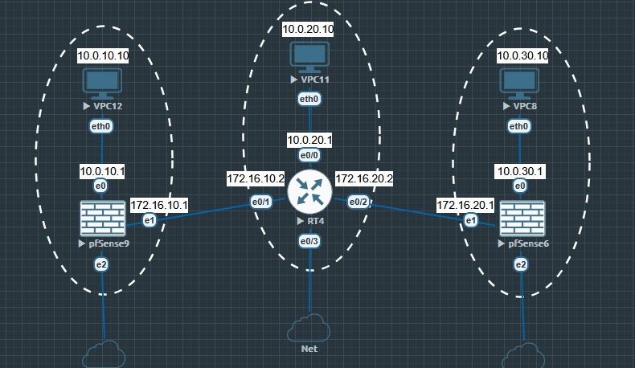
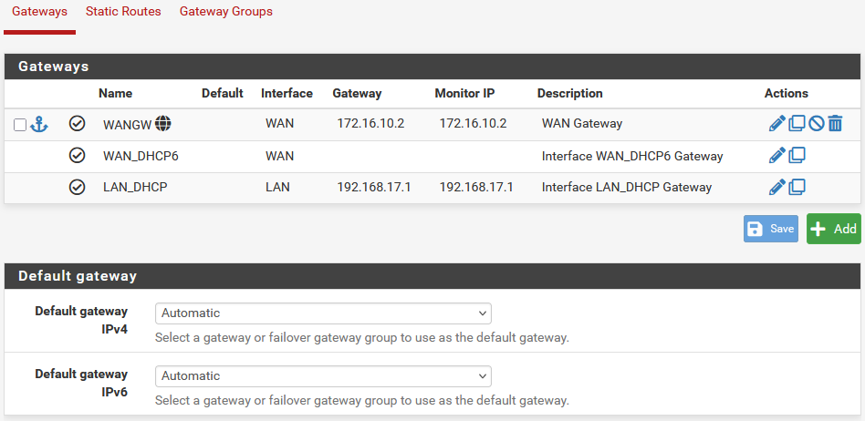
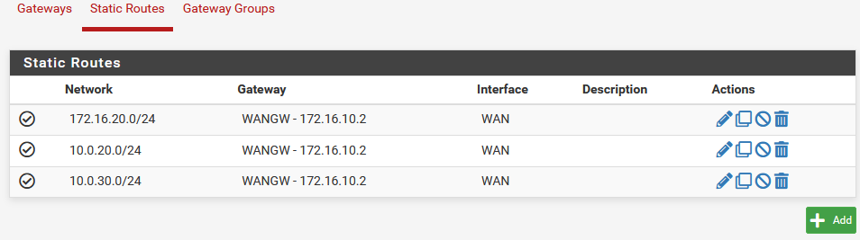
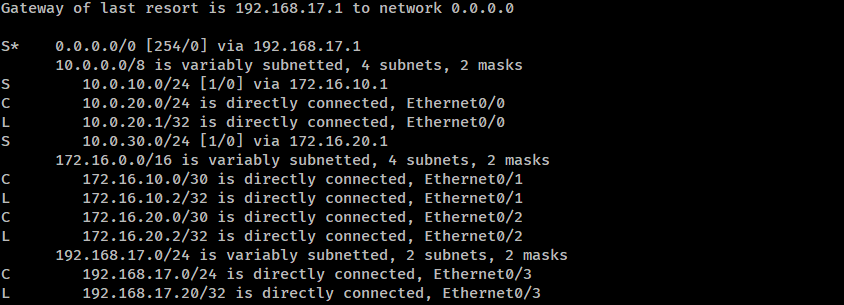
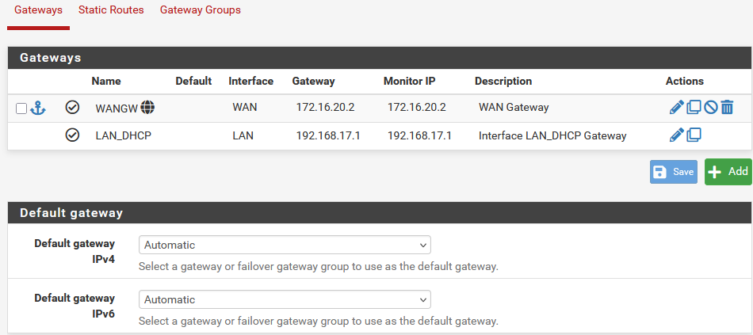
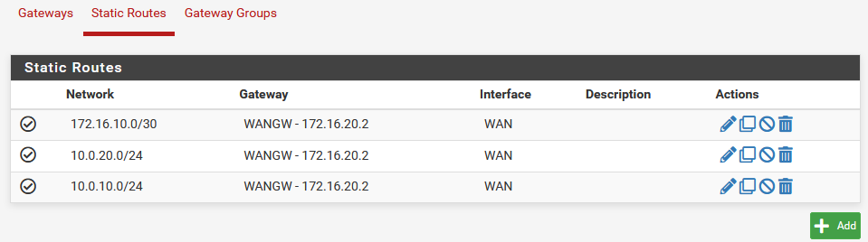

Primeiro devemos adicionar os nossos `Gateways`, que são as interface de próximo salto. Por exemplo, o `pfsense9` tem como próximo salto apenas a interface do `RT4` com o `IP` de `172.16.10.2`. Esses `Gateways` são adicionados em **`System / Routing / Gateways`**, onde também podemos adicionar um `Default Gateway`. E as rotas são adicionadas em **`System / Routing / Static Routes`**

>[!warning] Rede 192.168.17.0/24
>A rede `192.168.17.0/24` deve ser ignorada, pois ela está sendo usada apenas para acesso remoto.

***
#### pfsense9
**Próximo salto** : `172.16.10.2`

**`System / Routing / Gateways`**


**`System / Routing / Static Routes`**

***
#### RT4
**Próximo salto** : `172.16.10.1` e `172.16.20.1`

```ios
RT4# show ip route
```


***
#### pfsense6
**Próximo salto** : `172.16.20.2`

**`System / Routing / Gateways`**


**`System / Routing / Static Routes`**
