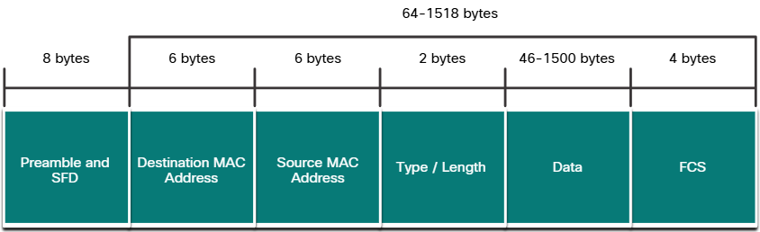

Ethernet operates in the data link layer and the physical layer. It is a family of networking technologies defined in the IEEE 802.2 and 802.3 standards. Ethernet supports the following data bandwidths:

- 10 Mbps
- 100 Mbps
- 1000 Mbps (1 Gbps)
- 10,000 Mbps (10 Gbps)
- 40,000 Mbps (40 Gbps)
- 100,000 Mbps (100 Gbps)

![[Pasted image 20250224135503.png]]

# Frame Ethernet
Cada frame tem basicamente 3 partes :
- Header
- Data
- Trailer

O Frame Ethernet tem o mínimo de 64 bytes e um máximo de 1518 bytes. Não incluímos o campo de preâmbulo na contagem do tamanho do Frame. Frames menores do que 64 bits são considerados fragmento de colisão e frames maiores do que 1500 bytes de dados são considerados "jumbo" ou "baby giant frames". Se o frame for menor do que o mínimo e maior do que o máximo, o pacote é descartado.
### Campos do Frame Ethernet

| Field                                     | Description                                                                                                                                                                                                                                                                                                                                                                                                                                                                                                                                                         |
| ----------------------------------------- | ------------------------------------------------------------------------------------------------------------------------------------------------------------------------------------------------------------------------------------------------------------------------------------------------------------------------------------------------------------------------------------------------------------------------------------------------------------------------------------------------------------------------------------------------------------------- |
| Preamble and Start Frame Delimiter Fields | The Preamble (7 bytes) and Start Frame Delimiter (SFD), also called the Start of Frame (1 byte), fields are used for synchronization between the sending and receiving devices. These first eight bytes of the frame are used to get the attention of the receiving nodes. Essentially, the first few bytes tell the receivers to get ready to receive a new frame.                                                                                                                                                                                                 |
| Destination MAC Address Field             | This 6-byte field is the identifier for the intended recipient. As you will recall, this address is used by Layer 2 to assist devices in determining if a frame is addressed to them. The address in the frame is compared to the MAC address in the device. If there is a match, the device accepts the frame. Can be a unicast, multicast or broadcast address.                                                                                                                                                                                                   |
| Source MAC Address Field                  | This 6-byte field identifies the originating NIC or interface of the frame.                                                                                                                                                                                                                                                                                                                                                                                                                                                                                         |
| Type / Length                             | This 2-byte field identifies the upper layer protocol encapsulated in the Ethernet frame. Common values are, in hexadecimal, 0x800 for IPv4, 0x86DD for IPv6 and 0x806 for ARP.   **Note**: You may also see this field referred to as EtherType, Type, or Length.                                                                                                                                                                                                                                                                                               |
| Data Field                                | This field (46 - 1500 bytes) contains the encapsulated data from a higher layer, which is a generic Layer 3 PDU, or more commonly, an IPv4 packet. All frames must be at least 64 bytes long. If a small packet is encapsulated, additional bits called a pad are used to increase the size of the frame to this minimum size.                                                                                                                                                                                                                                      |
| Frame Check Sequence Field                | The Frame Check Sequence (FCS) field (4 bytes) is used to detect errors in a frame. It uses a cyclic redundancy check (CRC). The sending device includes the results of a CRC in the FCS field of the frame. The receiving device receives the frame and generates a CRC to look for errors. If the calculations match, no error occurred. Calculations that do not match are an indication that the data has changed; therefore, the frame is dropped. A change in the data could be the result of a disruption of the electrical signals that represent the bits. |

---
# Ethernet MAC Address
Em uma LAN Ethernet todos os dispositivos estão conectados na mesma mídia. O endereço MAC é usado para identificar os dispositivos físicos no segmento local de rede.

É um endereço de 48 bits expressado em 12 dígitos em hexadecimal. Como um byte é igual a 8 bits o endereço MAC tem 6 bytes de comprimento. Cada MAC deve ser único, para isso todos os fornecedores devem se registrar no IEEE para obter um código hexadecimal de 6 dígitos chamado de **organizationally unique identifier** (OUI). Após isso o fornecedor deve fornecer mais 6 dígitos para cada dispositivo para completar o endereço.
## Multicast MAC Address
Um Frame Ethernet Multicast é recebido e processado por um grupo de dispositivos na LAN Ethernet que pertencem ao mesmo grupo Multicast.
- Existe um endereço MAC de destino 01-00-5E quando o dado encapsulado é um pacote IPv4 multicast ou um endereço 33-33 quando o dado encapsulado é um pacote IPv6 multicast.
- Há outro endereço MAC reservado quando o dado encapsulado não é um pacote IP, como STP ou LLDP.

Quando o dado encapsulado é um pacote IP de multicast, os dispositivos que pertencem ao grupo multicast recebem um endereço IP de grupo multicast. O range do endereço IP4 multicast é 224.0.0.0 até 239.255.255.255, e o de IPv6 começa com FFF0::/8

---
# Métodos de envio em um Switch cisco
Switch cisco tem atualmente dois métodos de enviar frames entre redes:
- **Store-and-forward switching** - Esse método recebe um frame inteiro e processa o CRC. CRC usa uma fórmula matemática, baseada no número de bits (1s) no frame, para determinar se o frame recebido contém algum erro. Além de ser necessário para análise de QoS em redes convergentes onde a classificação para a priorização do tráfego é necessária.
- **Cut-through switching** - Esse método de envio de frame envia o frame antes de ser inteiramente recebido. No mínimo o endereço de destino deve ser lido antes do frame ser enviado.
### Cut-through switching
Aqui o switch atua sobre os dados assim que eles são recebidos, mesmo se a transmissão esteja incompleta. O switch armazena somente o suficiente do frame para ler o MAC de destino que está nos 6 primeiros bytes, e determinar a interface de saída.

Há duas variantes :
- **Fast-forward switching** - Oferece um nível baixo de latência, pois começa a enviar o pacote imediatamente após a leitura do endereço MAC.
- **Fragment-free switching** - o switch armazena os primeiros 64 bytes do frame antes de o enviar. Pode ser vista como  entre a **store-and-forward switching** e **fast-forward switching**. Ele armazena apenas os 64 primeiros bytes pois a maioria dos erros de rede e colisões ocorrem durante os 64 primeiros bytes. Tenta melhorar a **Fast-forward switching** verificando os primeiros 64 bytes para garantir que não houve erros.
## Buffer de memória em Switches
Um switch Ethernet pode usar técnicas para armazenar Frames antes de envia-los. Pode ser usado quando a porta de destino está congestionada.

| Method                | Description                                                                                                                                                                                                                                                                                                                                                                                                                                              |
| --------------------- | -------------------------------------------------------------------------------------------------------------------------------------------------------------------------------------------------------------------------------------------------------------------------------------------------------------------------------------------------------------------------------------------------------------------------------------------------------- |
| **Port-based memory** | - Frames are stored in queues that are linked to specific incoming and outgoing ports. - A frame is transmitted to the outgoing port only when all the frames ahead in the queue have been successfully transmitted. - It is possible for a single frame to delay the transmission of all the frames in memory because of a busy destination port. - This delay occurs even if the other frames could be transmitted to open destination ports. |
| **Shared memory**     | - Deposits all frames into a common memory buffer shared by all switch ports and the amount of buffer memory required by a port is dynamically allocated. - The frames in the buffer are dynamically linked to the destination port enabling a packet to be received on one port and then transmitted on another port, without moving it to a different queue.                                                                                        |

## Duplex e configurações de velocidade
There are two types of duplex settings used for communications on an Ethernet network:
- **Full-duplex** - Both ends of the connection can send and receive simultaneously.
- **Half-duplex** - Only one end of the connection can send at a time.

A auto negociação é uma função opcional encontrada na maioria das interfaces Ethernet. Ela habilita que dois dispositivos auto negociem a melhor velocidade e recursos duplex. O Full-Duplex é escolhido se os dois dispositivos tiverem a capacidade, juntamente com a maior largura de banda comum.

## Auto-MDIX
Para conectar dois dispositivos precisamos usar um cabo crossover ou straight-through. O cabo crossover é utilizado quando conectamos dispositivos semelhantes, e o straight-through é usado quando conectamos dispositivos diferentes.

Podemos usar o recurso de Auto-MDIX, o switch pode detectar automaticamente o tipo de cabo plugado na interface, e a configura de acordo.

